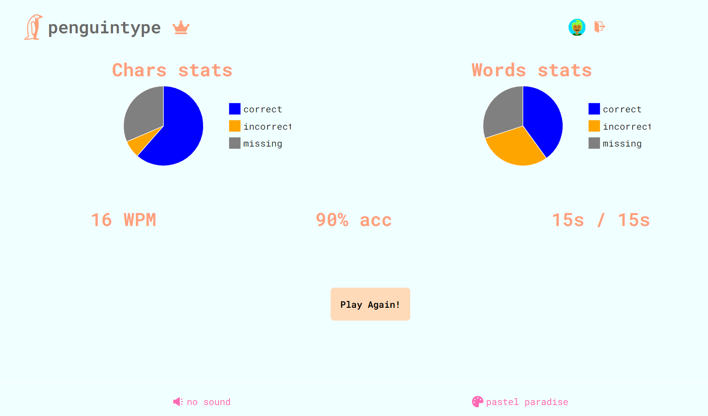
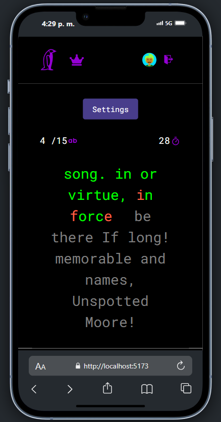
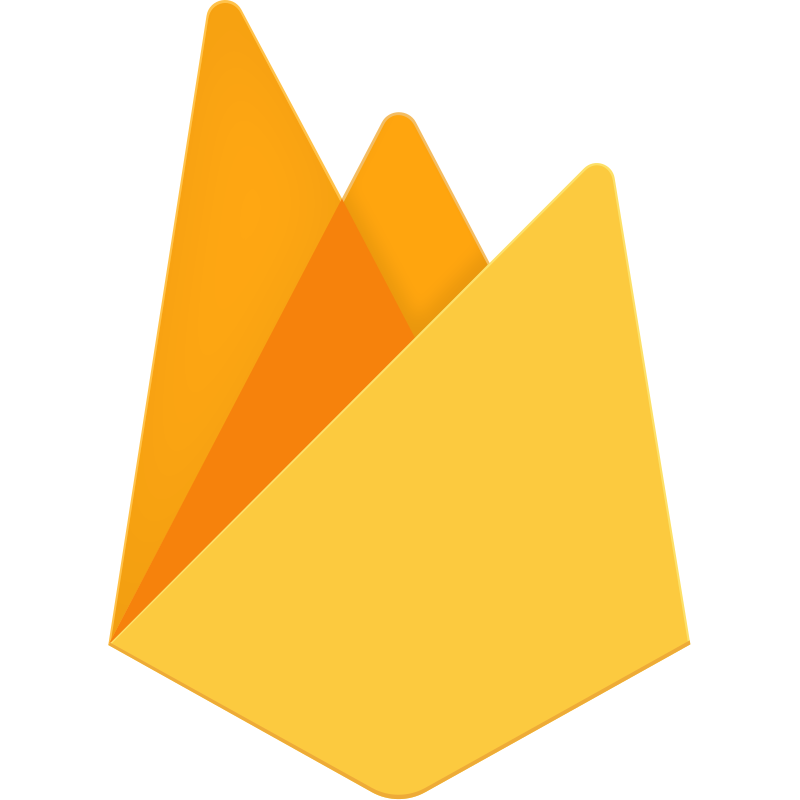
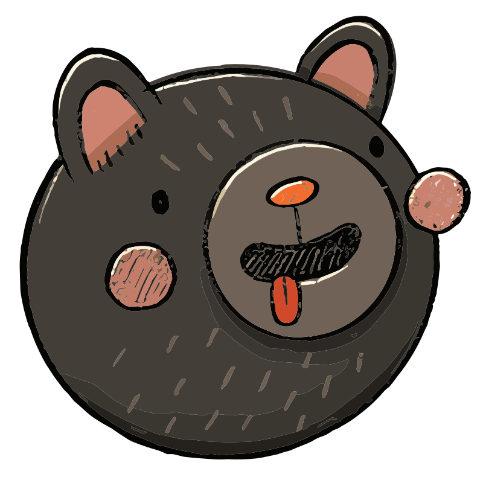
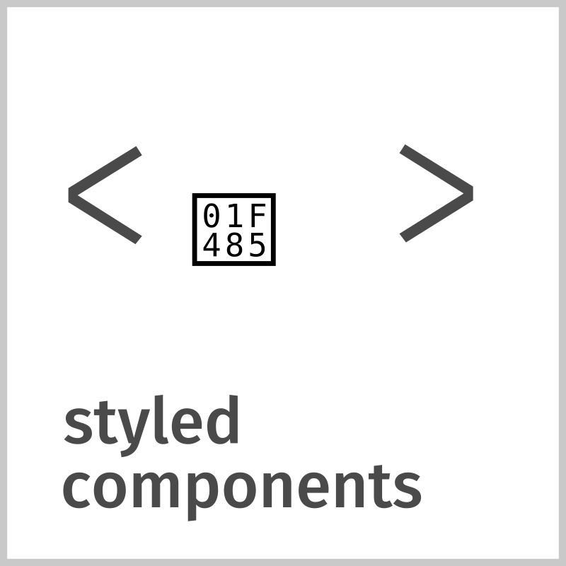
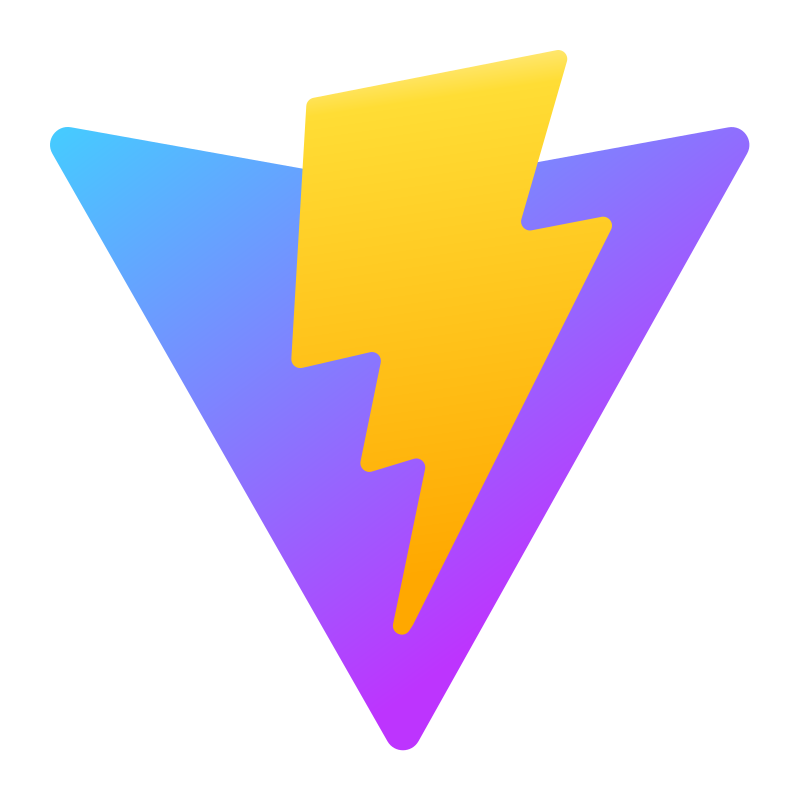
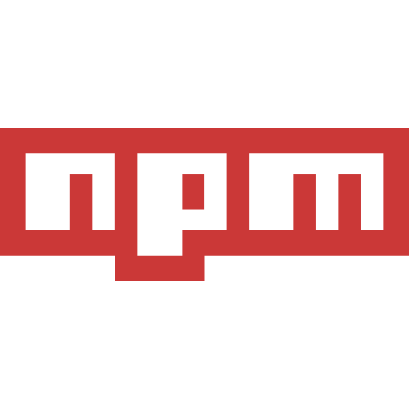

# PenguinType - Typing Game

PenguinType es una aplicación de escritura inspirada en [MonkeyType](https://monkeytype.com/), y desarrollada desde cero con nuevas características que la hacen una manera única de mejorar la mecanografía, complementando esta práctica con una experienca agradable y completa en todo sentido.

---

## Índice
- [Descripción](#descripción)
- [Características](#principales-características)
- [Tecnologías](#tecnologías-usadas)
- [Arquitectura](#arquitectura-del-proyecto)
- [Instalación](#instalación)

---

## Descripción

**PenguinType** es una aplicación moderna de escritura diseñada para ayudar a los usuarios a mejorar su velocidad y precisión en mecanografía. Inspirada en [MonkeyType](https://monkeytype.com/), esta plataforma ha sido creada desde cero utilizando **React** y **Firebase**, integrando nuevas funcionalidades que la convierten en una forma única y atractiva de practicar y medir habilidades de escritura.

El proyecto es especialmente interesante porque combina **múltiples áreas** del desarrollo de software, ofreciendo una experiencia integral para los usuarios. Al tratarse de un juego con funcionalidades de guardado de datos en tiempo real, el proyecto fusiona conceptos fundamentales de **lógica de programación**, **gestión eficiente de estados** y desarrollo frontend moderno. Además, el uso del **ciclo de vida de los componentes** en React y la interacción fluida con Firebase representan un desafío significativo, exigiendo un entendimiento profundo de la comunicación entre el cliente y la base de datos. 
Esta mezcla de tecnologías no solo pone a prueba habilidades técnicas, sino que también fomenta la **resolución creativa** de problemas, la gestión de flujos asíncronos y el diseño de interfaces **atractivas**, **responsivas** y **funcionales**, consolidando a PenguinType como un proyecto ideal para aprender, explorar y aplicar conocimientos de desarrollo más avanzados.

**Puedes ver la app desplegada [aquí](https://penguintype-7137e.web.app/)**.

<div style="display: flex; flex-direction: column; justify-content: center">
	<div style="height: 400px;">
  
  
</div>
</div>

---

## Principales Características

- Autenticación de usuarios (registro, inicio de sesión) con **Google** y **Github**.
- Guardado de datos de usuarios y partidas con **Firebase**.
- Leaderboard que permite observar las mejores puntuaciones.
- Análisis de resultados tras cada partida.
- Variedad de modos de juego, incluyendo modo libre y configuraciones adicionales para llevar tus capacidades al ritmo deseado.
- Soporte para múltiples **temas visuales** y **efectos de sonido**.

---

## Tecnologías Usadas

<div style="display: flex; align-items: center; margin-bottom: 8px;">
  
  <span style="margin-left: 8px; font-weight: bold; font-size: 1rem;">React</span>
</div>

<div style="display: flex; align-items: center; margin-bottom: 8px;">
  
  <span style="margin-left: 8px; font-weight: bold; font-size: 1rem;">Typescript</span>
</div>

<div style="display: flex; align-items: center; margin-bottom: 8px;">
  
  <span style="margin-left: 8px; font-weight: bold; font-size: 1rem;">Firebase</span>
</div>

<div style="display: flex; align-items: center; margin-bottom: 8px;">
  
  <span style="margin-left: 8px; font-weight: bold; font-size: 1rem;">Zustand</span>
</div>

<div style="display: flex; align-items: center; margin-bottom: 8px;">
  
  <span style="margin-left: 8px; font-weight: bold; font-size: 1rem;">Material UI</span>
</div>

<div style="display: flex; align-items: center; margin-bottom: 8px;">
  
  <span style="margin-left: 8px; font-weight: bold; font-size: 1rem;">Styled Components</span>
</div>

<div style="display: flex; align-items: center; margin-bottom: 8px;">
  
  <span style="margin-left: 8px; font-weight: bold; font-size: 1rem;">Vite</span>
</div>

<div style="display: flex; align-items: center; margin-bottom: 8px;">
  
  <span style="margin-left: 8px; font-weight: bold; font-size: 1rem;">NPM</span>
</div>

---

## Arquitectura del Proyecto

`components/`: Donde se almacenan los distintos componentes que integran la app.

`fetch/`: Funciones para hacer peticiones a APIs externas.

`firebase/`: Configuraciones de Firebase y funciones necesarias para extraer datos de este servicio.

`hooks/`: Custom hooks que encapsulan lógica clave para poder ser reutilizada.

`pages/`: Rutas de la app (frontend).

`store/`: Configuración y lógica necesaria para el estado global de la app, manejado con Zustand.

`styles/`: Estilos globales de la app.

`themes/`: Temas y paletas de colores de la app.

`types/`: Interfaces y tipos que modelan la estructura de los datos manejados en la app.

`utils/`: Funciones auxiliares que brindan utilidad a los diferentes componentes.

---

## Instalación
1. Clona el repositorio:
   ```bash
   git clone https://github.com/juanpeyrot/penguintype_public.git
   ```
2. Instala las dependencias:
   ```bash
   npm install
   ```
3. Crea un archivo `.env` con tus credenciales a partir del archivo `.env.template`.

4. Ejecuta la aplicación en desarrollo:
   ```bash
   npm run dev
   ```
